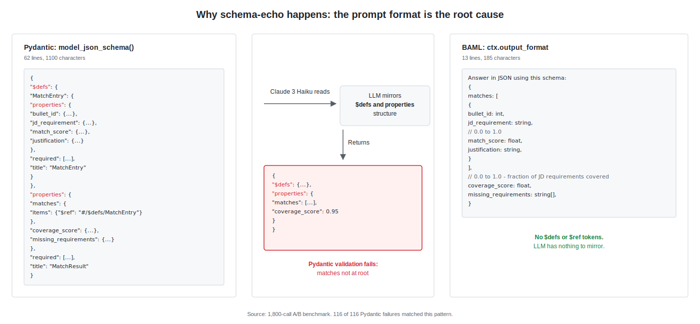

# BAML Diligence Eval

A 1,800-call A/B benchmark comparing [BAML](https://docs.boundaryml.com/)'s structured output reliability against raw [OpenAI](https://platform.openai.com/docs) + [Pydantic](https://docs.pydantic.dev/).

## Headline Result

| Pipeline | Pass rate | Sample size |
|----------|-----------|-------------|
| BAML     | **100%**  | **900/900** |
| Pydantic | **87.1%** | **784/900** |

All **116** Pydantic failures were the same failure mode (**schema-echo**), traceable to the prompt format Pydantic injects via [`model_json_schema()`](https://docs.pydantic.dev/latest/api/base_model/#pydantic.BaseModel.model_json_schema). Full analysis: [`docs/FINAL_REPORT.md`](docs/FINAL_REPORT.md).

## Why This Happens



Pydantic's `model_json_schema()` injects a **62-line** [JSON Schema](https://json-schema.org/specification) block into the prompt, complete with `$defs`, `properties`, `required`, and `title` keys. BAML's [`{{ ctx.output_format }}`](https://docs.boundaryml.com/ref/prompt-syntax/output-format) injects a **13-line** human-readable pseudo-schema with no JSON Schema meta-tokens. When Claude 3 Haiku sees the Pydantic schema, it mirrors the `$defs`/`properties` structure back as part of its response, wrapping the actual data inside the schema wrapper. The parser is the safety net; BAML's [Schema-Aligned Parsing](https://docs.boundaryml.com/blog/schema-aligned-parsing) recovers from these malformed responses. But the prompt format is the actual fix. A hardened Pydantic prompt that explicitly forbids prose and markdown eliminates all 116 failures, confirming the root cause is prompt-induced.

See [`docs/prompt_comparison.md`](docs/prompt_comparison.md) for the full side-by-side analysis, including token counts and debuggability assessment.

## Quick Start

A single A/B comparison run in about 30 seconds, approximately $0.01:

```bash
git clone https://github.com/thisisvk45/baml-diligence-eval.git
cd baml-diligence-eval
python3 -m venv .venv
source .venv/bin/activate
pip install -r requirements.txt
cp .env.example .env       # Add your OPENROUTER_API_KEY
baml-cli generate
python test_harness.py     # Single A/B run, ~30 seconds, ~$0.01
```

Requires Python 3.11 or later and an [OpenRouter](https://openrouter.ai/) API key with access to `anthropic/claude-3-haiku` and `openai/gpt-4o-mini`.

## Repository Contents

**Core implementation**

| File | Description |
|------|-------------|
| [`baml_src/matcher.baml`](baml_src/matcher.baml) | BAML schema, client configs (Haiku, GPT-4o-mini), matching function, 3 in-file tests, adversarial generator function |
| [`baml_src/generators.baml`](baml_src/generators.baml) | BAML generator config, Python/Pydantic output, pinned to baml-py 0.222.0 |
| [`main.py`](main.py) | BAML sync and streaming demo |
| [`main_pydantic.py`](main_pydantic.py) | Manual OpenAI + Pydantic equivalent with original and hardened prompt modes |

**Benchmark harness**

| File | Description |
|------|-------------|
| [`test_harness.py`](test_harness.py) | Single-run A/B comparison harness (3 test cases) |
| [`test_harness_100.py`](test_harness_100.py) | 100-run statistical harness with checkpointing and retry backoff (produces results.csv) |
| [`pipeline_harness.py`](pipeline_harness.py) | 50-run multi-stage pipeline harness (Stage 1 + Stage 2, BAML vs Pydantic) |
| [`pipeline_pydantic_stage2.py`](pipeline_pydantic_stage2.py) | Pydantic Stage 2 equivalent (CandidateVerdict from MatchResult) |

**Adversarial agent**

| File | Description |
|------|-------------|
| [`adversarial_agent.py`](adversarial_agent.py) | Uses BAML to generate adversarial attack cases, runs them through both pipelines |

**Data outputs**

| File | Description |
|------|-------------|
| [`results.csv`](results.csv) | Raw data from the 1,800-call benchmark (config, run, case, approach, latency, parse status, matches, coverage) |
| [`pydantic_failures.txt`](pydantic_failures.txt) | All **116** Pydantic parse failures with raw LLM responses and error messages |
| [`adversarial_cases.json`](adversarial_cases.json) | 18 adversarial test cases generated by the agent |
| [`adversarial_results.json`](adversarial_results.json) | Per-case pass/fail outcomes and failure classifications from the adversarial run |
| [`results/pipeline_results.csv`](results/pipeline_results.csv) | Raw data from the 200-call multi-stage pipeline benchmark |

**Analysis and documentation**

| File | Description |
|------|-------------|
| [`transcript.md`](transcript.md) | Claude Code session walkthrough: key decisions, dead ends, and the schema-echo discovery narrative |
| [`docs/FINAL_REPORT.md`](docs/FINAL_REPORT.md) | Full analysis report with tables, latency percentiles, failure taxonomy, and DX comparison |
| [`docs/prompt_comparison.md`](docs/prompt_comparison.md) | Side-by-side comparison of BAML vs Pydantic prompt formats with token counts |
| [`docs/rendered_prompt.txt`](docs/rendered_prompt.txt) | Rendered BAML prompt showing the actual text sent to the LLM |

## Full Benchmark

The Quick Start above runs a single trial per case. To reproduce the headline 1,800-call benchmark:

```bash
python test_harness_100.py     # 95 minutes, ~$0.71
python adversarial_agent.py    # 2 minutes, ~$0.07
```

Outputs go to [`results.csv`](results.csv), [`pydantic_failures.txt`](pydantic_failures.txt), and [`adversarial_results.json`](adversarial_results.json).

## Findings

Across 900 BAML calls, the parse success rate was **100%**. Across 900 Pydantic calls, the parse success rate was **87.1%**, with **116 failures**. Every failure was the same mode: **schema-echo**. The LLM returned a response wrapping the actual data inside the `$defs` and `properties` keys from the Pydantic JSON Schema, producing structurally valid JSON that did not conform to the expected top-level schema. BAML's [Schema-Aligned Parsing](https://docs.boundaryml.com/blog/schema-aligned-parsing) recovered from these malformed responses automatically.

The root cause is the prompt format, not the validation library. Pydantic's [`model_json_schema()`](https://docs.pydantic.dev/latest/api/base_model/#pydantic.BaseModel.model_json_schema) produces a 62-line [JSON Schema](https://json-schema.org/specification) block with nested meta-tokens that smaller models mirror back as output structure. BAML avoids this with a compact pseudo-schema. GPT-4o-mini did not exhibit schema-echo with either format. A hardened Pydantic prompt (explicitly instructing "no markdown, no prose, just raw JSON") eliminated all failures, confirming that well-engineered prompts close the reliability gap entirely.

### Adversarial Stress Test

The adversarial agent generated **18** attack cases targeting seven failure modes, then ran each through both pipelines:

| Pipeline | Adversarial pass rate |
|----------|-----------------------|
| BAML     | **18/18** (100%)      |
| Pydantic | **17/18** (94.4%)     |

The single Pydantic failure was **schema-echo** on an empty-input case. **No new failure modes were discovered.** See [`adversarial_results.json`](adversarial_results.json) for per-case outcomes.

### Multi-stage Sanity Check

A 200-call validation of composed BAML functions (Stage 1: `MatchJDToResume` -> Stage 2: `GenerateVerdict`) across 50 runs per framework. BAML achieved 100% end-to-end success (50/50). Pydantic achieved 94% (47/50), with all 3 failures concentrated in Stage 1 parsing. Stage 2 never failed independently, confirming that failures concentrate rather than compound across stages. Raw data: [`results/pipeline_results.csv`](results/pipeline_results.csv). Harness: [`pipeline_harness.py`](pipeline_harness.py).

## Methodology

- **Models**: [`anthropic/claude-3-haiku`](https://openrouter.ai/anthropic/claude-3-haiku) and [`openai/gpt-4o-mini`](https://openrouter.ai/openai/gpt-4o-mini), both accessed via [OpenRouter](https://openrouter.ai/)
- **Sample size**: 100 trials per cell (3 test cases x 2 approaches x 3 configs = 18 cells, **1,800 total calls**)
- **Confidence intervals**: 95% [Wilson score intervals](https://en.wikipedia.org/wiki/Binomial_proportion_confidence_interval#Wilson_score_interval) on pass rates
- **Temperature**: 0.2 for all calls
- **No retries**: Failures are recorded as-is to measure raw reliability
- **Adversarial generation**: 18 cases generated by GPT-4o-mini via BAML, tested against Claude 3 Haiku

## Limitations

- Single task domain (job description to resume bullet matching). Results may not generalize to other structured output tasks.
- Two models tested. Behavior on other model families (Llama, Mistral, Gemini) is unknown.
- Single provider ([OpenRouter](https://openrouter.ai/)). Provider-level caching or routing could affect results.
- Sample size (n=100 per cell) is adequate for detecting high-frequency failure modes but insufficient for rare failures below approximately 3%.
- Latency comparisons are confounded by token count differences between BAML and Pydantic prompts (the Pydantic prompt includes a 62-line JSON Schema block).
- The adversarial generator used the same model family (GPT-4o-mini) for case generation, which may limit the diversity of attack patterns.

## Context

Built as part of a technical diligence exercise for [Basis Set Ventures](https://www.basisset.com/). The full investment memo, including thesis and recommendations, lives separately. See [`docs/FINAL_REPORT.md`](docs/FINAL_REPORT.md) for the complete technical analysis with latency percentiles, failure taxonomy, and developer experience comparison.

## References

- **BAML documentation**: [docs.boundaryml.com](https://docs.boundaryml.com/)
- **Schema-Aligned Parsing (SAP)**: [BAML blog post on SAP](https://docs.boundaryml.com/blog/schema-aligned-parsing)
- **BAML prompt syntax / `ctx.output_format`**: [Prompt syntax reference](https://docs.boundaryml.com/ref/prompt-syntax/output-format)
- **Pydantic `model_json_schema()`**: [Pydantic API docs](https://docs.pydantic.dev/latest/api/base_model/#pydantic.BaseModel.model_json_schema)
- **JSON Schema specification**: [json-schema.org](https://json-schema.org/specification)
- **Wilson score interval**: [Wikipedia](https://en.wikipedia.org/wiki/Binomial_proportion_confidence_interval#Wilson_score_interval)
- **OpenRouter API**: [openrouter.ai/docs](https://openrouter.ai/docs)

## Thesis

> BAML's reliability advantage is not a parsing technology. It is a prompt-engineering opinion encoded into a framework. The moat is not the SAP; the moat is the default.

## License

MIT
